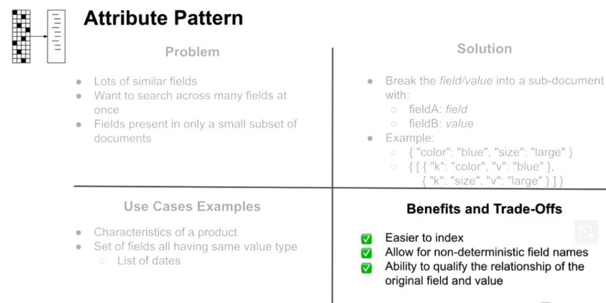
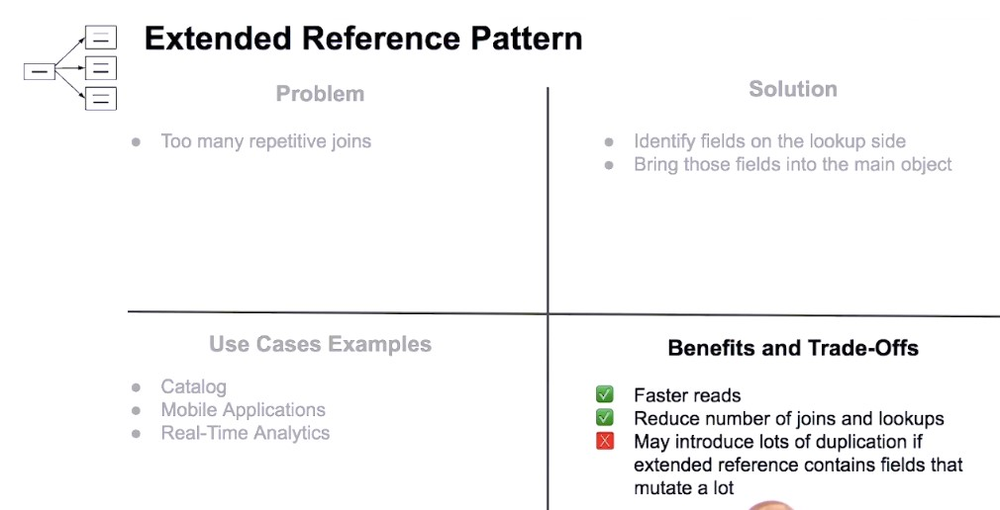
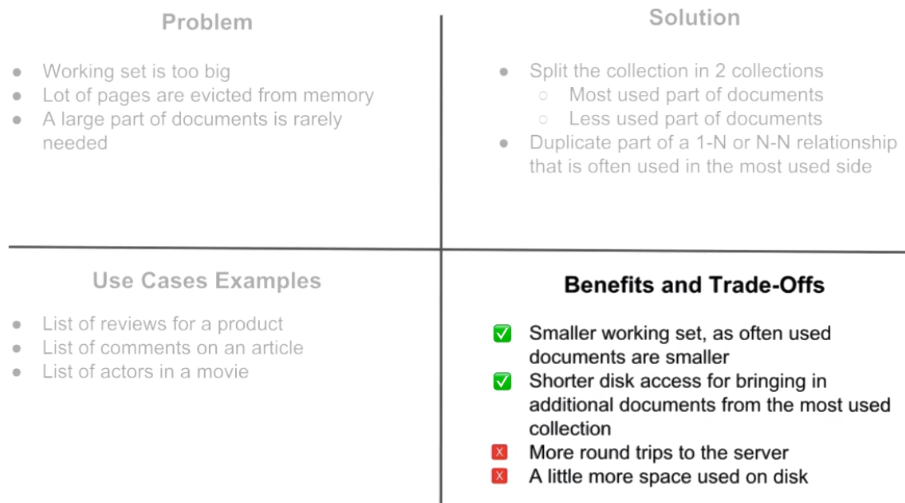

# General (hints, important points)
- Cascade deletes are not supported so if we use eg. one-to-many reference in the "one" side approach
  we have to manage that in application

# Relations

### Approaches to data relationships
* linking (reference)
* embedding

### Cardinalities
* one-to-one
* one-to-many
* many-to-many
* one-to-zillions (BigData)

### One to many
* Decide the side "one" or "many"
* Duplication may occur when "many" side was selected. It may be ok or even preferable
* Prefer embedding over referencing. If number of references is small it is better to keep it together
* Embed on the side of the most queried collection
* Prefer referencing when associated documents aren't always fetched with the most queried documents

Examples: 
* customer-invoice
* people-credit_cards  

### Many to many
In relational databases we are using "jump" table.
So effectively we have two one-to-many sides of relations with extra table in the middle.

* We should usually embed data in the most queried side of relation
* Even if we embed data on the most queried side we want to store these 
documents additionally on the separate collection - there might be other 
places in the application also using these data in other way without those other
side they are duplicated.  
Eg. We have products catalog.
Products are additionally stored in order documents as embedded. 
But collection with all products still exists as separate.
* Referencing is done by adding array of references (ids)
* Prefer embedding on the most queried side
* Prefer embedding for information that is primarily static over time and may profit from duplication
* Prefer referencing over embedding to avoid managing duplication

Examples:
* invoice-products

### One to one
* We can embed as field of document or group information into sub-documents into a document - preferred only 
in case of schema optimization reasons or in case of smaller dick access or smaller amount od RAM needed
* We can reference by same identifier in both documents or in one of two sides
* Prefer embedding over referencing for simplicity
* Use subdocuments to organize the fields
* Use a reference for optimization purposes

# Patterns

### Duplication
Benefits, use cases:
- Faster access

Concerns:
- Eliciting correctness and consistency

Examples:
- Order should contain copy of customer address. Without it if user change address in the future it also changes for historical orders.
- Precomputing eg. we have several movie screenings and in the movie document itself we want to store sum of all screenings revenues.

### Staleness
How to solve:
- batch updates
- change stream

### Referential integrity
When occur:
- data were deleted from one document but wasn't from other where data were duplicated

Concerns:
- No support cascading deletes
- Challenge for correctness and consistency

Examples:
-
How to solve:
- change streams (what is acceptable staleness because of eventual consistency)
- single document were data are located (embedding instead in linking)
- multi documents transaction

### Attribute pattern
Orthogonal pattern to Polymorphism.



### Extended reference pattern


### Subset pattern
Reduces working set size.


### Example_section
Benefits, use cases:
- 

Concerns:
- 

Examples:
- 

# Tools

### Using schema validator
```powershell
.\validate_m320 example --file answer_schema.json
```

### TODO/to learn, implements
- Change stream in app (as BackgroundService?)
